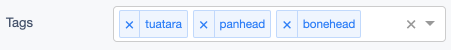

# Tag Field

[](https://github.com/silverstripe/silverstripe-tagfield/actions/workflows/ci.yml)
[](https://www.silverstripe.org/software/addons/silverstripe-commercially-supported-module-list/)

Custom tag input field, for SilverStripe.

## Overview



Allows storing tags as a relationship, or comma-delimited strings.
Supports autocompletion with lazy-loading.

Note: The field is optimised for usage in the Silverstripe CMS UI.
The form field class itself can be used outside of the CMS,
but you'll need to build your own frontend to interpret the raw field data (`data-schema` attribute).

## Requirements

* Silverstripe 4.0

## Installing

```sh
$ composer require silverstripe/tagfield
```

## Using

### Relational Tags

```php
use SilverStripe\ORM\DataObject;

class BlogPost extends DataObject
{
    private static $many_many = [
        'BlogTags' => BlogTag::class
    ];
}
```

```php
use SilverStripe\ORM\DataObject;

class BlogTag extends DataObject
{
    private static $db = [
        'Title' => 'Varchar(200)',
    ];

    private static $belongs_many_many = [
        'BlogPosts' => BlogPost::class
    ];
}
```

```php
$field = TagField::create(
    'BlogTags',
    'Blog Tags',
    BlogTag::get(),
    $this->BlogTags()
)
    ->setShouldLazyLoad(true) // tags should be lazy loaded
    ->setCanCreate(true);     // new tag DataObjects can be created
```
**Note:** This assumes you have imported the namespaces class, e.g. use
SilverStripe\TagField\TagField;


#### Has-One Relations

You can also use the TagField to select values for `has_one` relations.
Let's assume, that a `BlogPost` *has one* `BlogCategory`.

```php
class BlogCategory extends DataObject
{
    private static $db = [
        'Title' => 'Varchar(200)',
    ];
}
```

```php
use SilverStripe\ORM\DataObject;

class BlogPost extends DataObject
{
    private static $has_one = [
        'BlogCategory' => BlogCategory::class
    ];
}
```

```php
$field = TagField::create(
    'BlogCategoryID',
    $this->fieldLabel('BlogCategory'),
    BlogCategory::get()
)
    ->setIsMultiple(false)
    ->setCanCreate(true);
```

**Note:** We're using the `ID` suffix for the field-name (eg. `BlogCategoryID` instead of `BlogCategory`) and
only allow one value by setting `->setIsMultiple(false)`

### String Tags

```php
use SilverStripe\ORM\DataObject;

class BlogPost extends DataObject
{
    private static $db = [
        'Tags' => 'Text',
    ];
}
```

```php
$field = StringTagField::create(
    'Tags',
    'Tags',
    ['one', 'two'],
    explode(',', $this->Tags)
);

$field->setShouldLazyLoad(true); // tags should be lazy loaded
```

You can find more in-depth documentation in [docs/en](docs/en/introduction.md).

## Using TagField with silverstripe-taxonomy

TagField assumes a `Title` field on objects. For classes without a `Title` field
use `setTitleField` to modify accordingly.

```php
$field = TagField::create(
    'Tags',
    'Blog Tags',
    TaxonomyTerm::get(),
)
    ->setTitleField('Name');
```

## Versioning

This library follows [Semver](http://semver.org). According to Semver, you will
be able to upgrade to any minor or patch version of this library without any
breaking changes to the public API. Semver also requires that we clearly define
the public API for this library.

All methods, with `public` visibility, are part of the public API. All other
methods are not part of the public API. Where possible, we'll try to keep
`protected` methods backwards-compatible in minor/patch versions, but if you're
overriding methods then please test your work before upgrading.

## Reporting Issues

Please [create an
issue](http://github.com/silverstripe/silverstripe-tagfield/issues) for any bugs
you've found, or features you're missing.
